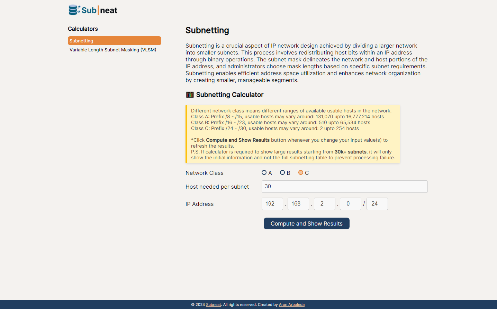
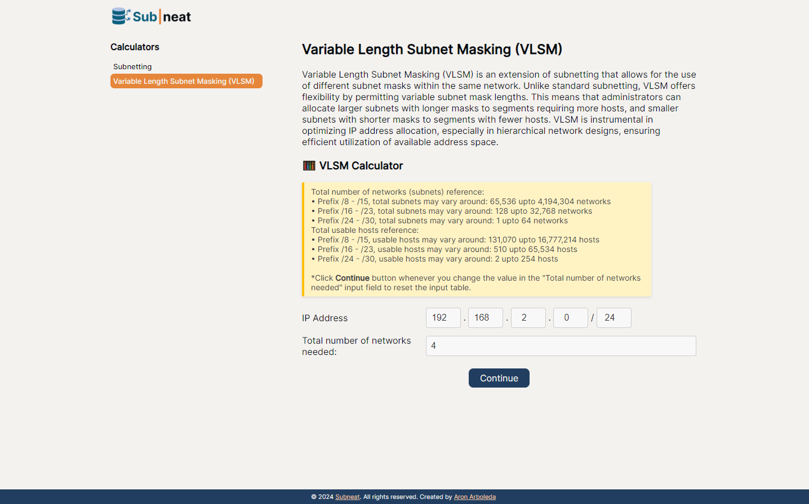

# SubnettingAndVLSMCalculator


## Info

- **Developer**: Aron-Arboleda
- **Started**: Jan 2024

## Subnetting and VLSM Calculator for Networking

This website is dedicated to helping networking professionals in quickly and accurately dividing and subnetting networks. Its user-friendly platform caters to individuals of all skill levels, offering intuitive tools and resources for efficient network segmentation. With a seamless interface, the platform simplifies the complexities of network subdivision, saving time and enhancing productivity. Committed to continuous improvement, the creator strive to provide a comprehensive solution that meets the evolving needs of networking professionals worldwide.

## Features

- Calculates subnets for a given IP address and CIDR.
- Calculates VLSM for a given IP address and list of required hosts.
- User-friendly interface.
- Responsive design.

## Tech Stack

- HTML
- CSS
- JavaScript
- Webpack
- Vitest
- ESLint

## File Directory Structure

```
SubnettingAndVLSMCalculator/
├── dist/
├── LICENSE
├── package-lock.json
├── package.json
├── README.md
└── src/
```

## Instructions

### To use the website

- Go to the link: https://aron-arboleda.github.io/SubnettingAndVLSMCalculator/

## Features still in development

- Practice questions functionality for subnetting and vlsm
- Subnetting ipv6 networks

## Pages

### Home Page


### Subnetting Page



### VLSM Page



<br>&copy; 2024 Aron-Arboleda. All rights reserved.
