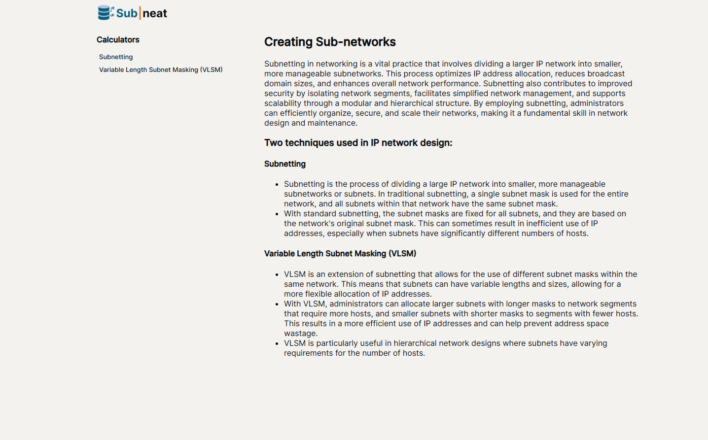

# SubnettingAndVLSMCalculator 

## Subnetting and VLSM Calculator for Networking

## Instructions
### To use the app
* Go to the link: https://aron-arboleda.github.io/SubnettingAndVLSMCalculator/

## Features still in development
* VLSM Page
* Practice questions functionality for subnetting and vlsm
